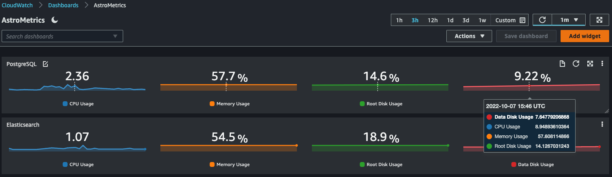

## ALPRS Monitoring

A custom CloudWatch Agent configuration is installed on each EC2 instance
to forward selected metrics and relevant application logs to CloudWatch.

A basic dashboard like the one below showing CPU, memory, and disk usage
for each of the 7 servers can be found in CloudWatch from the AWS Console.



Two CloudWatch alarms have also been set up to monitor the **data disk
usage** on PostgreSQL and Elasticsearch instances.  
A breach of the 90% threshold will result in an email notification to
our DevOps team.

## Health Check

A health check script is installed on the bastion host in "`/home/ec2-user/health-check`"
to accompany the corresponding cron job definition in "`/etc/cron.d`".  
It runs every 10 minutes and makes a subset of the API calls that the
frontend webapp makes during user login.  
If this simulated login fails two consecutive times, the script will
send an email notification to our DevOps team.

The customary fix for login failure is to **restart the Datastore**
service via the steps below:

```bash
$ ssh alprsproddata

# run the "olstart" shortcut function
ubuntu@alprsprod-datastore:~$ olstart
+ cd /opt/openlattice
+ killall java
+ sleep 2
+ APP_FLAGS=(aws postgres "$@")
+ echo 67396
+ JAVA_OPTS=' '
+ ./datastore/bin/datastore aws postgres

# run "mol" to view the application
# logs and make sure banner appears
ubuntu@alprsprod-datastore:~$ mol
```

## CloudWatch Agent

If CloudWatch Agent configurations have been updated and pushed to S3
by Terraform, they can be applied to **existing instances** by running
the following command via SSH:

```bash
sudo su -l
CWAGENT_HOME=/opt/aws/amazon-cloudwatch-agent
aws s3 cp s3://$(hostname | sed -En 's|^alprs([^-]+)-(.+)$|alprs-infra-\1/userdata/\2|p')/cwagent.json $CWAGENT_HOME/etc/amazon-cloudwatch-agent.json
$CWAGENT_HOME/bin/amazon-cloudwatch-agent-ctl -a fetch-config -m ec2 -s -c file:$CWAGENT_HOME/etc/amazon-cloudwatch-agent.json
logout
```
